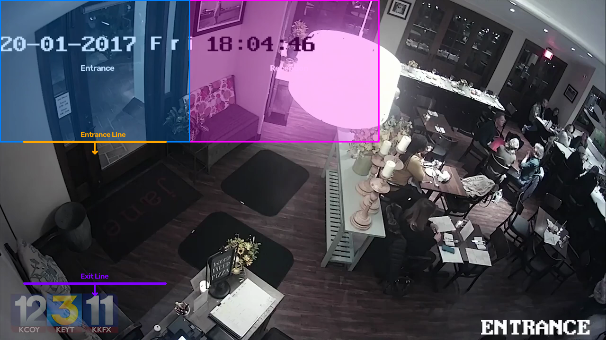

# Restaurant Scene Calibration Report

- **Date:** 2026-07-09 15:16:44
- **Source Video File:** `Dark_lighting.mp4`
- **Layout Resolution:** 1280x720 pixels
- **Calibrated Polygon Zones:** 2
- **Calibrated Counting Lines:** 2

## Defined Polygon Zones List

| Zone Name | Vertices Count | Color (BGR) |
|---|---|---|
| **Reception** | 4 | `[255, 0, 255]` |
| **Entrance** | 4 | `[255, 128, 0]` |

## Defined Counting Lines List

| Line Name | Start Point | End Point | Crossing Direction |
|---|---|---|---|
| **Entrance Line** | [50, 300] | [350, 300] | `in` |
| **Exit Line** | [50, 600] | [350, 600] | `out` |

## Layout Overview Blueprint

Below is the reference snapshot blueprint showing overlay boundaries:

