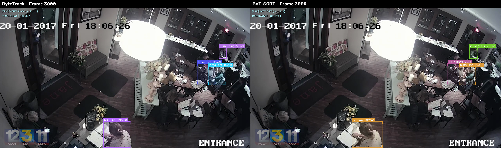

# Experiment 001 — ByteTrack vs BoT-SORT Comparison Report

## Executive Summary

> **Final Decision:** `Same`
> **Overall Recommendation:** Both trackers show equivalent tracking quality. Keep ByteTrack to avoid additional complexity.

## Detailed Metrics Table

| Metric | ByteTrack | BoT-SORT | Winner |
|---|---|---|---|
| Average active tracks | 10.19 | 10.24 | **BoT-SORT** |
| Maximum active tracks | 19.00 | 19.00 | **Draw** |
| Track recovery count | 514.00 | 490.00 | **ByteTrack** |
| Lost tracks | 707.00 | 665.00 | **BoT-SORT** |
| Track fragmentation | 271.00 | 246.00 | **BoT-SORT** |
| ID switches | N/A (requires ground truth) | N/A (requires ground truth) | **N/A** |
| Median FPS | 46.89 | 7.47 | **ByteTrack** |
| Median inference time | 1.63 ms | 112.81 ms | **ByteTrack** |
| Peak RAM | 457.26 MB | 496.57 MB | **ByteTrack** |
| Runtime | 126.63 s | 794.83 s | **ByteTrack** |

## Visual Comparison Analysis

We captured annotated screenshots at key frames of interest during both pipeline executions to evaluate performance under low-lighting, occlusion, and crowding.

### 1. Entrance Area / Low-Lighting (Frame 1000)

### 2. Crowded Workplace Interaction (Frame 3000)

### 3. Occlusion and Crossing (Frame 5000)

### 4. Dense Interaction (Frame 8000)

### 5. Final Stage Tracking (Frame 10000)

