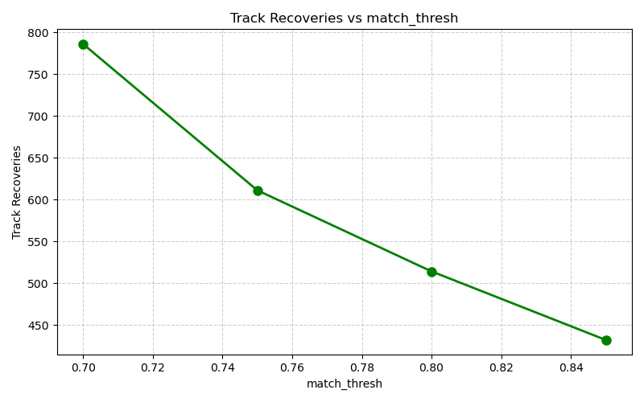
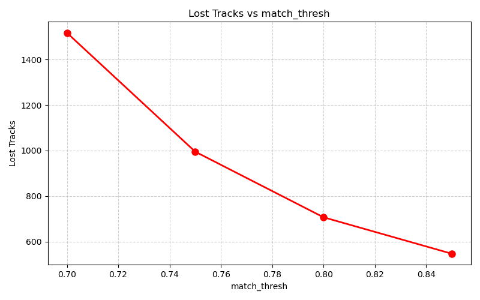
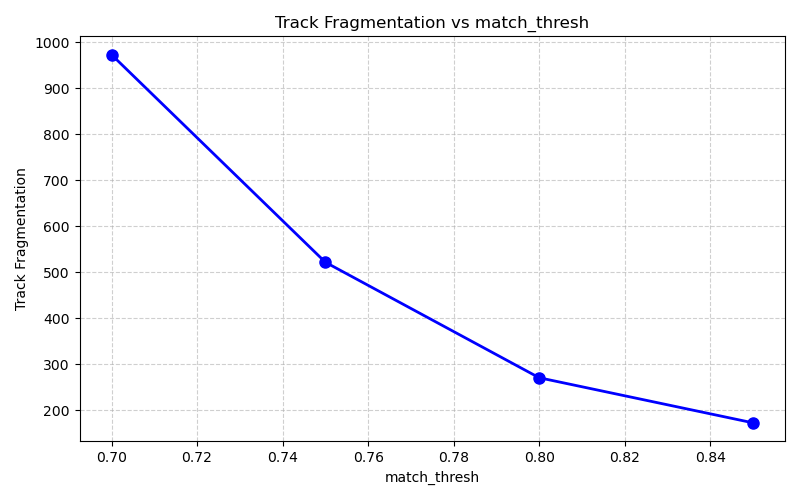

# Experiment 002 — ByteTrack Optimization: match_thresh

## Executive Summary

> **Decision Rule Outcome:** `Promote best config`
> **Overall Recommendation:** The configuration `match_thresh=0.85` demonstrates a meaningful improvement in tracking stability (Score: -288 vs Baseline: -464). We recommend promoting this value to production configs/config.yaml.

## Detailed Parameter Sweep Summary Table

| Value of `match_thresh` | Avg Tracks | Max Tracks | Recoveries ↑ | Lost ↓ | Fragmentation ↓ | Median FPS | Inference Time | Peak RAM |
|---|---|---|---|---|---|---|---|---|
| `0.7` | 8.54 | 17 | 786 | 1517 | 973 | 7.3 | 120.2 ms | 362 MB |
| `0.75` | 9.65 | 18 | 611 | 995 | 522 | 7.6 | 118.7 ms | 471 MB |
| `0.8` | 10.19 | 19 | 514 | 707 | 271 | 6.9 | 119.8 ms | 459 MB |
| `0.85` | 10.37 | 19 | 432 | 547 | 173 | 7.9 | 115.1 ms | 458 MB |

## Configuration Ranking

1. **Best Configuration:** `match_thresh=0.85` (Score: -288)
2. **Worst Configuration:** `match_thresh=0.7` (Score: -1704)

## Visualization Charts

### 1. Recoveries vs match_thresh

### 2. Lost Tracks vs match_thresh

### 3. Track Fragmentation vs match_thresh

