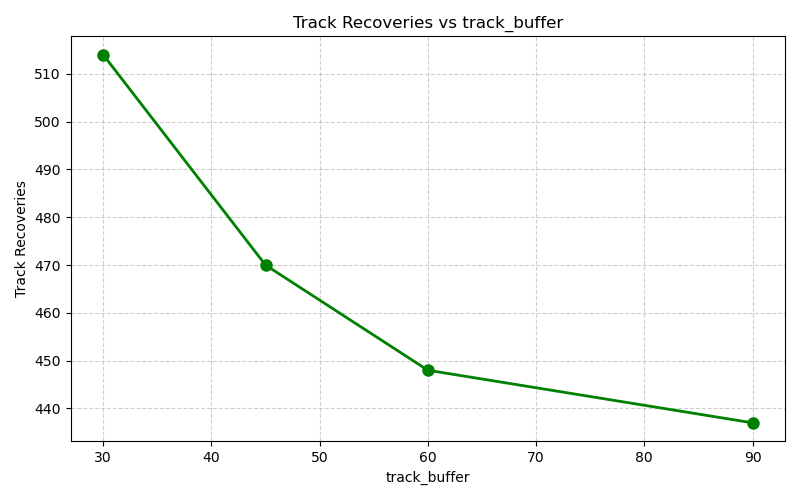
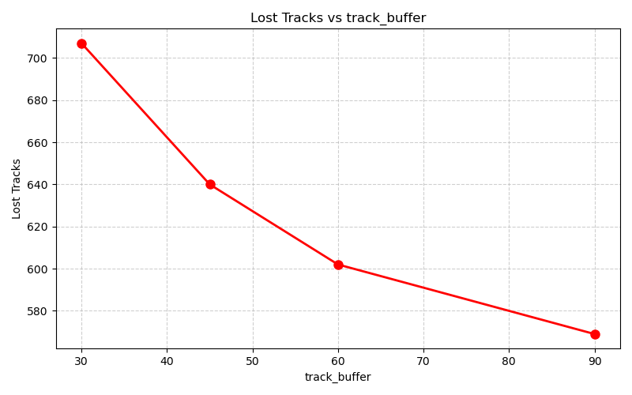
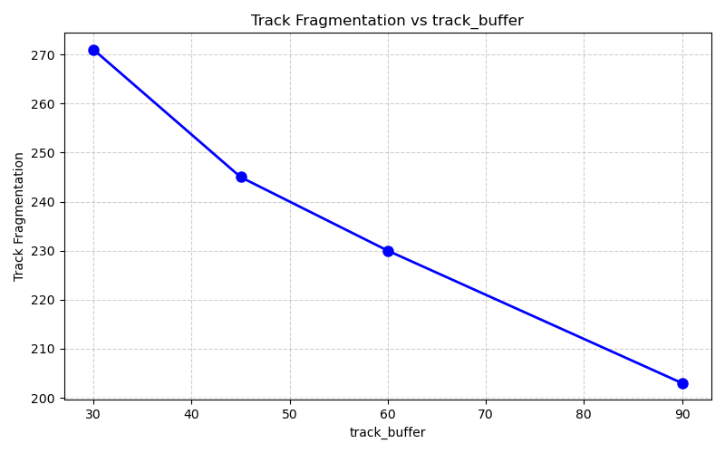

# Experiment 002 — ByteTrack Optimization: track_buffer

## Executive Summary

> **Decision Rule Outcome:** `Promote best config`
> **Overall Recommendation:** The configuration `track_buffer=90` demonstrates a meaningful improvement in tracking stability (Score: -335 vs Baseline: -464). We recommend promoting this value to production configs/config.yaml.

## Detailed Parameter Sweep Summary Table

| Value of `track_buffer` | Avg Tracks | Max Tracks | Recoveries ↑ | Lost ↓ | Fragmentation ↓ | Median FPS | Inference Time | Peak RAM |
|---|---|---|---|---|---|---|---|---|
| `30` | 10.19 | 19 | 514 | 707 | 271 | 7.3 | 115.9 ms | 426 MB |
| `45` | 10.24 | 19 | 470 | 640 | 245 | 6.5 | 126.9 ms | 491 MB |
| `60` | 10.26 | 19 | 448 | 602 | 230 | 5.8 | 133.8 ms | 377 MB |
| `90` | 10.29 | 19 | 437 | 569 | 203 | 7.3 | 120.9 ms | 362 MB |

## Configuration Ranking

1. **Best Configuration:** `track_buffer=90` (Score: -335)
2. **Worst Configuration:** `track_buffer=30` (Score: -464)

## Visualization Charts

### 1. Recoveries vs track_buffer

### 2. Lost Tracks vs track_buffer

### 3. Track Fragmentation vs track_buffer

