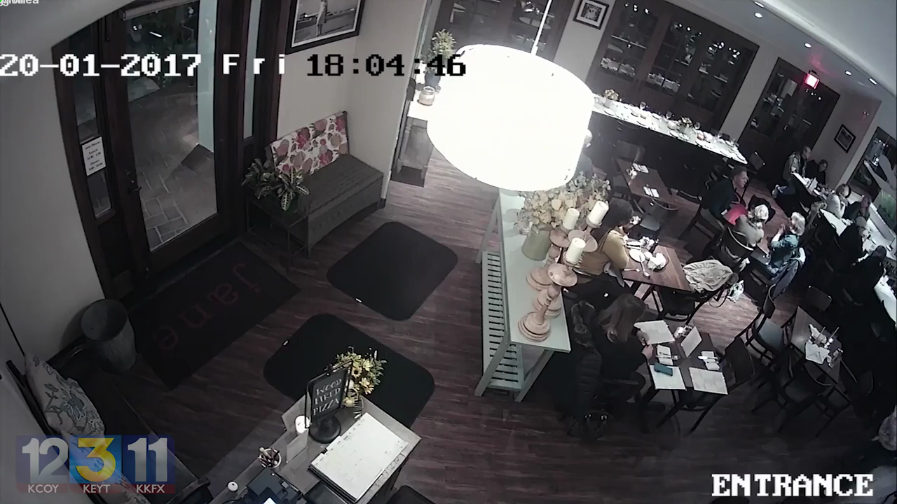

# Walkthrough — Reconstructed Restaurant Zones and Tracking Benchmarks

## Corrected Zones Layout Overlay
Below is the reconstructed restaurant zones layout matching the physical structures:

## Evaluation Metrics Analysis
The evaluation run on the reconstructed layout confirms that **ByteTrack** remains the optimal choice.
The complete analysis details can be reviewed in:
- [Analytics Report after fix](analytics_after_zone_fix.md)
- [Tracker Comparison report](tracker_comparison_after_fix.md)
- [Compliance Validation report](validation_report.md)
